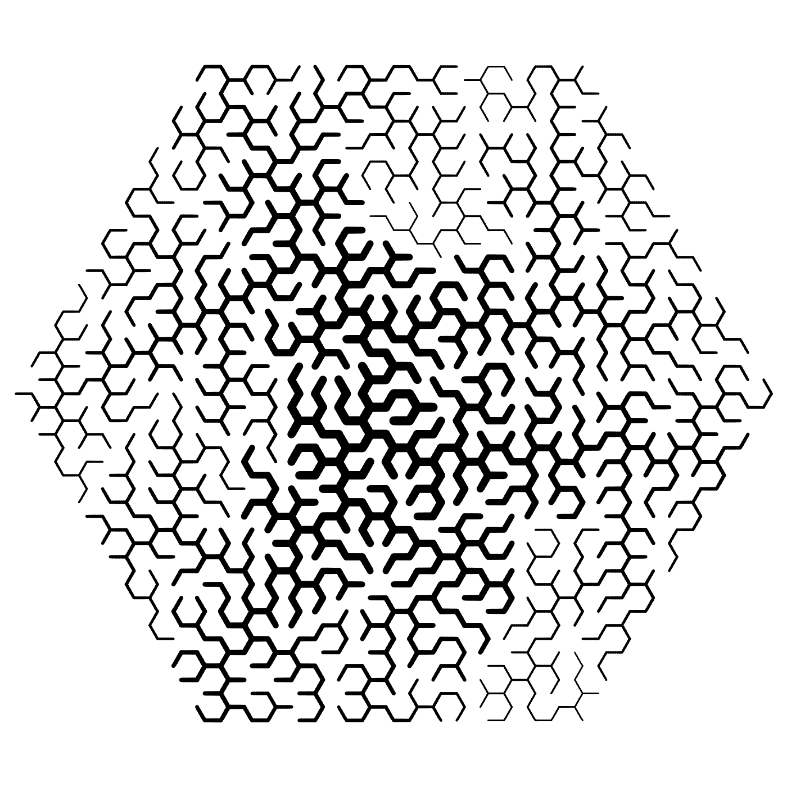
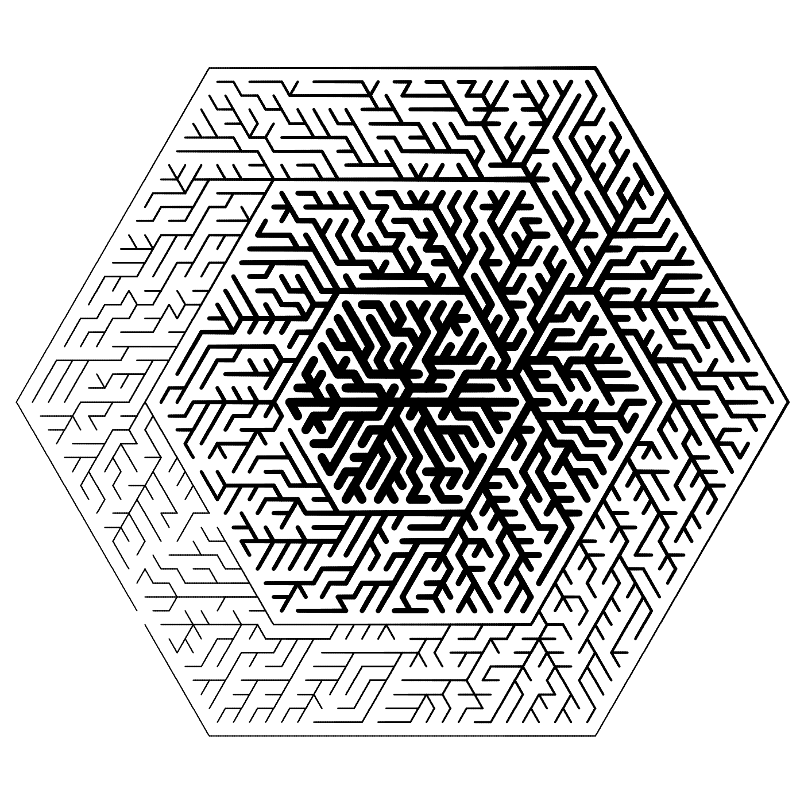

HexTattoo is a Processing program that generates visually pleasing images written by @mglst and @felixvonsamson. The "Tattoo" part comes from Felix having a tattoo of an earlier square-grid rendition of the project.

